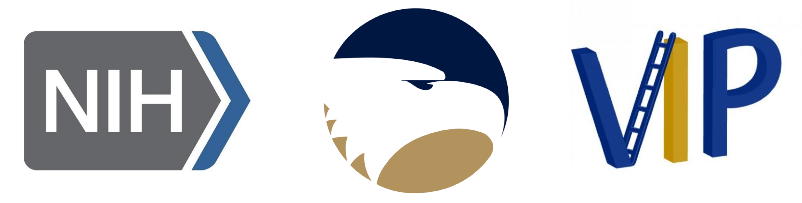

::::: home-hero
:::: hero-copy
[GEORGIA SOUTHERN UNIVERSITY · SAVANNAH]{.eyebrow}

# Curiosity leads to cures.

[Laboratory of Structural Biology and Drug Discovery]{.lab-name}

We explore how proteins work—and how to target them. Our research connects protein structure and dynamics with the discovery of potential therapies for cancer and infectious diseases.

::: hero-actions
[Explore our research](research/index.qmd){.btn .btn-primary} [Meet the team](people/index.qmd){.btn .btn-outline-primary} [Join the lab](contact.qmd#join){.btn .btn-outline-primary}
:::
::::

:::: hero-photo
{fig-alt="Science Center at the Armstrong Campus in Savannah, home of the dela Cerna lab"}
::::
:::::

:::: home-section
## Proteins at the center of discovery

::: theme-grid
:::: theme-item
### Structure & dynamics

We investigate how protein structure, motion, and interactions shape function, with a focus on protein tyrosine phosphatases and homeodomains.

[Explore structural biology](research/index.qmd#prl3-structure-and-dynamics)
::::

:::: theme-item
### Drug discovery

We combine computational screening, protein biochemistry, and cellular assays to identify and characterize molecules targeting disease-related proteins.

[Explore drug discovery](research/index.qmd#prl3-drug-discovery)
::::

:::: theme-item
### Shared curiosity

Our lab collaborates across disciplines and welcomes students interested in asking new questions about proteins and biology.

[Work with us](contact.qmd)
::::
:::
::::

:::: home-section
## Latest from the lab

::: latest-grid

:::

[All lab news](news/index.qmd){.btn .btn-outline-primary}
::::

:::: {.home-section .funding-section}
## Supporting our research

Our PRL3 research is funded by the **National Institutes of Health** through **R16GM154696**, with additional instrumentation support through **S15OD039824**. Our work also receives support from Georgia Southern's Faculty Council Seed Grant, COSM Collaborative Grant Initiatives with Dr. Brown and Dr. Chitiyo, the Vertically Integrated Projects Program, and the Office of Research and Economic Development.

{.funding-image fig-alt="Current funding sources supporting the lab" loading="lazy"}
::::
