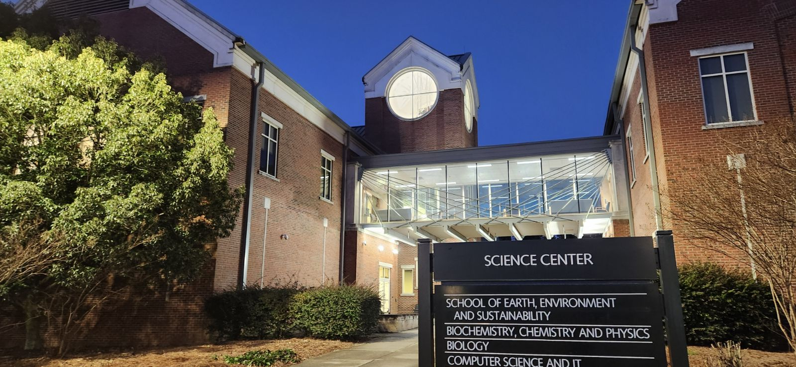

::: {.intro .text-center}
**Welcome to our lab's online home!**
:::

::: front-matter-fig
{.hero-img fig-alt="The Science Center at Georgia Southern University's Armstrong Campus" width="100%"}
:::

## About Our Research

The lab focuses its investigations on proteins—from the fundamental relationship between structure, function, and dynamics to exploring their potential as molecular targets in various diseases. We work on a variety of protein families with a strong emphasis on **protein tyrosine phosphatases (PTPs)**, a superfamily of phosphatases.

Several drug discovery programs are currently ongoing for development of potential therapeutics, including:

-   **Anti-cancer and anti-metastasis compounds** targeting human PTPs
-   **Antimicrobials** targeting bacterial PTPs

Additionally, we are interested in uncovering the relationship between protein structure, function, and dynamics. The lab also collaborates with other investigators within and outside Georgia Southern to pursue projects related to biochemistry, broadly.

::::::: home-band
## What are we currently working on? {.text-center}

:::::: columns
::: {.column width="45%"}
### Structure and Dynamics

We are currently focused on determining the structure of **protein tyrosine phosphatases** and their complexes with inhibitors, primarily **PRL3** bound to novel inhibitors our group has identified. We are also investigating the relationship of structure, function, and dynamics of **homeodomains**.
:::

::: {.column width="10%"}
:::

::: {.column width="45%"}
### Drug Discovery

Active drug discovery programs in the lab are focused on targeting several PTPs, notably **PRL3** for migrastatics and **SP-PTP** from *S. pyogenes* for antimicrobial development. We also have active programs against **GMPK**, **MDMX**, and **ERα**.
:::
::::::
:::::::

::: {.d-flex .justify-content-center .gap-3 .flex-wrap .my-4}
[Explore our Research](research/){.btn .btn-outline-primary .btn-lg} [Meet the Team](people/){.btn .btn-outline-primary .btn-lg} [Latest News](news/){.btn .btn-outline-primary .btn-lg}
:::